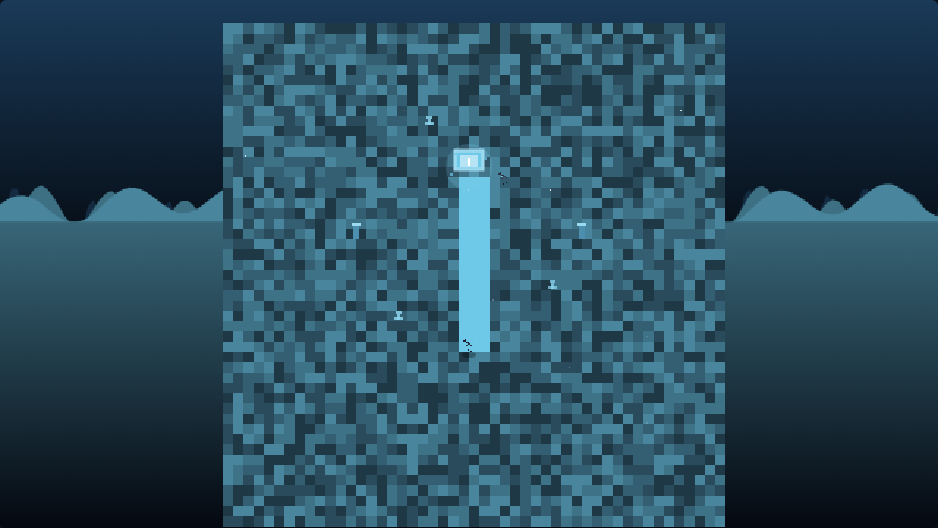
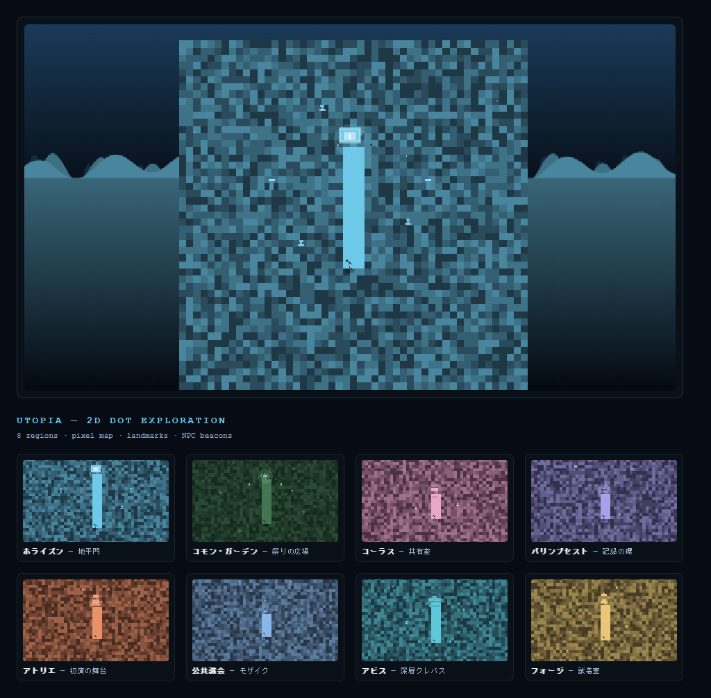

# UTOPIA — 最後の必要のあと

> 世界は救われた。もう、誰も救わなくていい。  
> では、人類は何を未来に手渡すのか。

三人称探索アドベンチャー ＋ ナラティブRPG ＋ 社会制度シミュレーション。

## ブラウザで遊ぶ

**[▶ プロトタイプをプレイ](https://jim-auto.github.io/Utopia/)**

序章以降は **Three.js / WebGL** による3D探索、または **2Dドット絵** 探索が有効になります。フッターの **◈ 3D / ▣ 2D** で切り替え可能です。

- **WASD / 矢印** — 移動
- **ドラッグ** — 視点（三人称・3Dのみ）
- **V** — 一人称 / 三人称切替（3Dのみ）
- **E / 調べる** — ランドマーク付近で場所の意味を発見
- **ホイール** — カメラ距離（3Dのみ）
- 左スティック（タッチ端末）— 移動
- 発光オブジェクトに **Bloom**、空は **シェーダ空**、話者NPCは **3Dラベル** で表示

物語の選択は画面下部のパネルから進めます。

### 2Dドット絵探索

フッターの **▣ 2D** に切り替えると、Canvas ピクセルアートの俯瞰マップで同じ世界を歩けます。



<details>
<summary>8地域のスクリーンショット</summary>



</details>

- 各地域のドット絵タイル・オブジェクト・ランドマーク
- NPCビーコン（話者キャラの色付きスプライト）
- ミニマップ・パーティクル・道タイル

> スクリーンショットの再生成: `npm install && npx playwright install chromium && npm run capture:2d`

> 初回は Settings → Pages → Build and deployment → Source を **GitHub Actions** に設定し、`main` へ push してください。

### ローカルで試す

```bash
# Python
python -m http.server 8080

# Node.js
npx serve .
```

ブラウザで http://localhost:8080 を開く（ES modules のため、ファイルを直接開くよりローカルサーバー推奨）。

### プロトタイプの内容（約25〜30分）

| システム | 体験できる内容 |
|---------|---------------|
| **3D探索** | 地域ごとの低ポリ環境を歩き回る（Three.js） |
| **2D探索** | ドット絵スタイルの俯瞰マップ（パーティクル・ミニマップ・各地域オブジェクト） |
| プレゼンス | 同時に選べない出来事、見送った記録 |
| 誓約 | ソリの初演 / 無名の集団との約束 |
| コヴナント・グラマー | 制度条項の選択と試行（#03 #04 #05 #06 #07 #12） |
| 五年後の再訪 | 深層の命名（#07） |
| 三年後の再訪 | 感覚の共有期間（#06） |
| 五年後の再訪 | 条項ごとの社会変化（#03） |
| 十年後の再訪 | 百年庭園（#05） |
| モザイク評価 | 命令しない神の1年後（#12） |
| 理由の地図 | 文脈付き理由の引用と「安定した異議」 |
| エンディング | 6種の出発憲章から選択 |

## ドキュメント

| ドキュメント | 内容 |
|-------------|------|
| [GDD 目次](docs/gdd/00-index.md) | ゲームデザインドキュメント全体 |
| [NPC設計](docs/narrative/00-index.md) | 主要キャスト・関係図・拒否フック |
| [用語集](docs/glossary.md) | 固有名詞・システム用語 |
| [システム仕様](docs/systems/00-overview.md) | ゲームシステムの技術向け仕様 |

## コア命題

**意味には「取り消せなさ」が必要である。しかし正義には「退出できること」が必要である。**

基本動詞: **出会う → 約束する → 生きる → 見届ける → 改める**

## リポジトリ構成

```
index.html          # ブラウザ版プロトタイプ（Three.js import map）
css/  js/           # ゲーム本体（js/world3d.js, js/world2d.js, js/player-model.js）
docs/
  images/           # README 用スクリーンショット
  gdd/              # 企画・世界観・物語
  systems/          # システム仕様
  glossary.md       # 用語集
.github/workflows/  # GitHub Pages デプロイ
```
